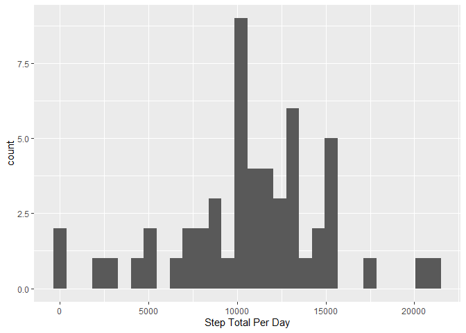
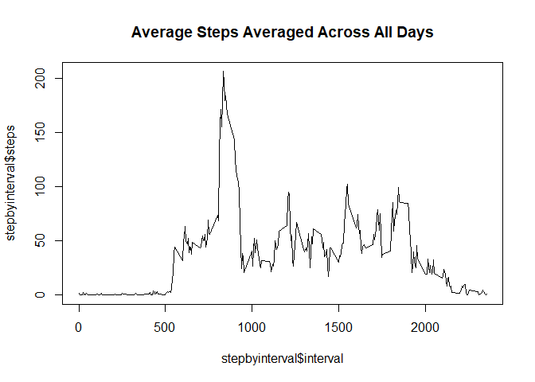
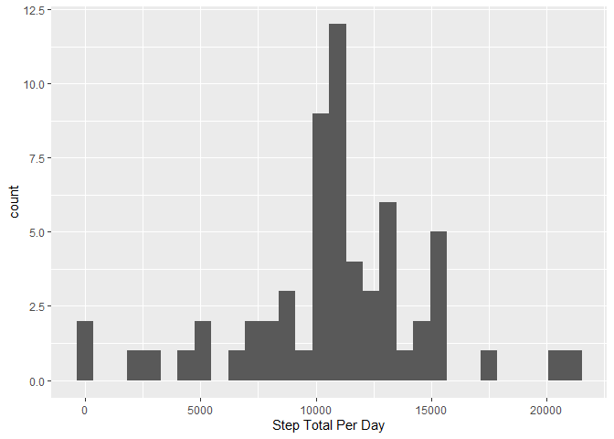
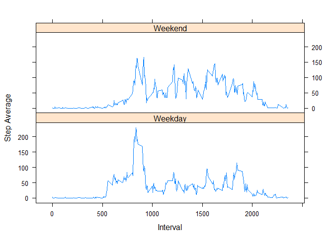

# Loading data


```r
library(readr)
```

```
## Warning: package 'readr' was built under R version 4.0.2
```

```r
library(tidyverse)
```

```
## Warning: package 'tidyverse' was built under R version 4.0.2
```

```
## -- Attaching packages ------------------------------------- tidyverse 1.3.0 --
```

```
## v ggplot2 3.3.2     v dplyr   1.0.0
## v tibble  3.0.3     v stringr 1.4.0
## v tidyr   1.1.1     v forcats 0.5.0
## v purrr   0.3.4
```

```
## Warning: package 'ggplot2' was built under R version 4.0.2
```

```
## Warning: package 'tibble' was built under R version 4.0.2
```

```
## Warning: package 'tidyr' was built under R version 4.0.2
```

```
## Warning: package 'purrr' was built under R version 4.0.2
```

```
## Warning: package 'dplyr' was built under R version 4.0.2
```

```
## Warning: package 'forcats' was built under R version 4.0.2
```

```
## -- Conflicts ---------------------------------------- tidyverse_conflicts() --
## x dplyr::filter() masks stats::filter()
## x dplyr::lag()    masks stats::lag()
```

```r
library(ggplot2)
library(lubridate)
```

```
## Warning: package 'lubridate' was built under R version 4.0.2
```

```
## 
## Attaching package: 'lubridate'
```

```
## The following objects are masked from 'package:base':
## 
##     date, intersect, setdiff, union
```

```r
library(dplyr)
library(data.table)
```

```
## Warning: package 'data.table' was built under R version 4.0.2
```

```
## 
## Attaching package: 'data.table'
```

```
## The following objects are masked from 'package:lubridate':
## 
##     hour, isoweek, mday, minute, month, quarter, second, wday, week,
##     yday, year
```

```
## The following objects are masked from 'package:dplyr':
## 
##     between, first, last
```

```
## The following object is masked from 'package:purrr':
## 
##     transpose
```

```r
library(lattice)
activity <- read_csv("activity.csv")
```

```
## Parsed with column specification:
## cols(
##   steps = col_double(),
##   date = col_date(format = ""),
##   interval = col_double()
## )
```

# What is mean total number of steps taken per day?

## Calculate total number of steps per day

```r
activity$date <- as.Date(activity$date)
stepbydatetotal <- aggregate(activity$steps, by=list(activity$date), sum)
colnames(stepbydatetotal) <- c("day", "steptotal")
stepbydatetotal$day <- as.POSIXct(stepbydatetotal$day)
stepbydatetotal <- na.omit(stepbydatetotal)
```


## Histogram


```r
ggplot(stepbydatetotal, aes(x = steptotal)) + geom_histogram()+ xlab("Step Total Per Day")
```

```
## `stat_bin()` using `bins = 30`. Pick better value with `binwidth`.
```

<!-- -->


## Calculate and report mean and median steps per day


```r
Meansteps <- mean(stepbydatetotal$steptotal)
Mediansteps <- median(stepbydatetotal$steptotal)
```


# What is the average daily activity pattern?

## Time-series plot

### Data Prep

```r
stepbyinterval <- aggregate(steps ~ interval, data = activity, mean)
```
### Plot

```r
plot(stepbyinterval$interval, stepbyinterval$steps, type = "l", main = "Average Steps Averaged Across All Days")
```

<!-- -->

## Which interval contains the max steps?

```r
intervalmax <- which.max(stepbyinterval$steps)
stepbyinterval [intervalmax,]
```

```
##     interval    steps
## 104      835 206.1698
```

# Imputting Missing Values

## Calculate and report missing values


```r
NAdata <- activity[!complete.cases(activity),]
NArows <- nrow(NAdata)
```

## Devise a strategy for filling in the missing values


```r
activity2 <- activity

for (i in 1:nrow(activity2)){
       if (is.na(activity2$steps[i])){
             intervalvalue <- activity2$interval[i]
             rowID <- which(stepbyinterval$interval == intervalvalue)
             stepvalue <- stepbyinterval$steps[rowID]
             activity2$steps[i] <- stepvalue}
}
```

## Create New dataset


```r
stepbydatetotal2 <- aggregate(activity2$steps, by=list(activity2$date), sum)

colnames(stepbydatetotal2) <- c("day", "steptotal")
stepbydatetotal2$day <- as.POSIXct(stepbydatetotal2$day)
```
## Histogram


```r
ggplot(stepbydatetotal2, aes(x = steptotal)) + geom_histogram()+ xlab("Step Total Per Day")
```

```
## `stat_bin()` using `bins = 30`. Pick better value with `binwidth`.
```

<!-- -->
## and mean and median steps per day

```r
Meansteps2 <- mean(stepbydatetotal2$steptotal)
Mediansteps2 <- median(stepbydatetotal2$steptotal)
```
### Do these values differ from the estimates from the first part of the assignment? 
The means are the same. The new median is now the same as the mean, different from the value calculated without filling in the data
.
### What is the impact of imputing missing data on the estimates of the total daily number of steps?
In this case, not much. In other situations it could help (or hurt) more, though.

# Are there differences in activity patterns between weekdays and weekends?

## create new factor variable


```r
day <- weekdays(activity2$date)
daylevel <- vector()

for (i in 1:nrow(activity2)) {
    if (day[i] == "Saturday") {
       daylevel[i] <- "Weekend"
    } else if (day[i] == "Sunday") {
       daylevel[i] <- "Weekend"
    } else {
        daylevel[i] <- "Weekday"
    }
}
```

## make panel plot, etc.

```r
activity2$daylevel <- daylevel
activity2$daylevel <- factor(activity2$daylevel)
stepsbyday <- aggregate(steps ~ interval + daylevel, data = activity2, mean)
names(stepsbyday) <- c("interval", "daylevel", "steps")
```

```r
xyplot(steps ~ interval | daylevel, stepsbyday, type = "l", layout = c(1, 2), xlab = "Interval", ylab = "Step Average")
```

<!-- -->

